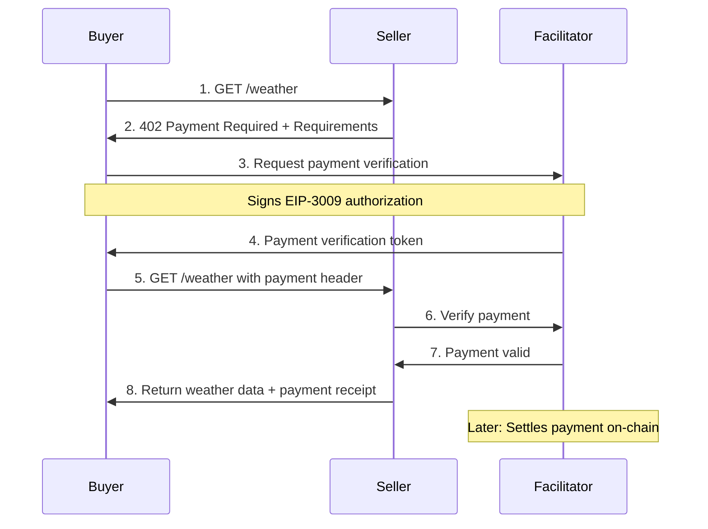

# x402 Developer Guide - Polygon Amoy Facilitator

## What is x402?

x402 is an HTTP-native micropayments protocol that enables instant, automatic stablecoin payments directly over HTTP. By using the HTTP 402 Payment Required status code, x402 allows services to:
- Monetize APIs and digital content on-chain
- Enable programmatic payments without accounts or sessions
- Support both human and AI agent interactions

## Quick Start with x402 

This guide shows how to quickly integrate x402 payments using the x402 helper packages and the Polygon facilitator.

### Prerequisites

1. Node.js installed
2. A wallet with USDC on Polygon Amoy testnet (the facilitator handles gas fees)
   - Get testnet USDC from [Circle's Faucet](https://faucet.circle.com/)
   - Select "Polygon PoS Amoy" from the network dropdown
   - You can request 10 USDC per hour per address
3. Basic familiarity with Express.js (for sellers)

### Step 1: Project Setup

```bash
# Create a new directory and initialize
mkdir x402-demo && cd x402-demo
npm init -y

# Install required packages
npm install express x402-express x402-fetch ethers@^6.0.0
```

### Step 2: Configure Environment

Create a `.env` file:

```env
# Your wallet private key (for signing payments)
PRIVATE_KEY=your_private_key_here

# The Polygon facilitator URL (no need to change)
FACILITATOR_URL=https://x402.polygon.technology

# Your receiving address (for sellers)
PAYMENT_ADDRESS=0xYourPolygonAddress
```

### Step 3: Create a Seller Service

Create `seller.js`:

```javascript
import express from "express";
import { paymentMiddleware } from "x402-express";

const app = express();

app.use(paymentMiddleware(
  process.env.PAYMENT_ADDRESS, // your receiving wallet address
  {  
    "GET /weather": {
      price: "$0.001",  // USDC amount in dollars
      network: "polygon-amoy",
      config: {
        description: "Get current weather data",
        inputSchema: {
          type: "object",
          properties: {
            location: { type: "string" }
          }
        }
      }
    },
  },
  {
    url: process.env.FACILITATOR_URL || "https://x402.polygon.technology",
  }
));

app.get("/weather", (req, res) => {
  res.json({
    weather: "sunny",
    temperature: 70,
  });
});

app.listen(4021, () => {
  console.log(`Seller running on http://localhost:4021`);
});
```

### Step 4: Create a Buyer Client

Create `buyer.js`:

```javascript
import { wrapFetchWithPayment, decodeXPaymentResponse } from "x402-fetch";

const account = process.env.PRIVATE_KEY;
const fetchWithPayment = wrapFetchWithPayment(fetch, account);

fetchWithPayment("http://localhost:4021/weather", {
  method: "GET",
})
  .then(async response => {
    const data = await response.json();
    console.log("Response:", data);

    const paymentResponse = decodeXPaymentResponse(
      response.headers.get("x-payment-response")
    );
    console.log("Payment details:", paymentResponse);
  })
  .catch(error => {
    console.error("Error:", error.response?.data?.error || error.message);
  });
```

### Step 5: Run the Demo

1. Start the seller:
```bash
node seller.js
```

2. In a new terminal, run the buyer:
```bash
node buyer.js
```

The buyer will:
1. Make initial request to `/weather`
2. Receive 402 with payment requirements
3. Sign an EIP-3009 payment authorization
4. Retry with payment header
5. Receive weather data and payment confirmation

## How It Works

### Flow Diagram



1. **Seller Flow**:
   - Uses `x402-express` middleware to protect routes
   - Configures prices in USD (converted to USDC)
   - Returns 402 + payment requirements when no payment
   - Verifies payments via Polygon facilitator
   - Returns content after verification

2. **Buyer Flow**:
   - Uses `x402-fetch` to wrap fetch calls
   - Automatically handles 402 responses
   - Signs payment authorizations using provided wallet
   - Retries requests with payment headers
   - Decodes payment confirmations

3. **Facilitator's Role**:
   - Validates payment authorizations
   - Handles nonce tracking and replay protection
   - Executes on-chain settlement (EIP-3009)
   - Covers all gas fees for transactions
   - Returns transaction hashes and receipts

## Notes and Best Practices

- Always use testnet (Polygon Amoy) for development
- Keep private keys secure and never commit them
- Set reasonable payment amounts for testing
- Monitor the `x-payment-response` header for transaction status
- Consider implementing receipt verification for high-value endpoints

## Troubleshooting

- Ensure your wallet has sufficient USDC on Polygon Amoy testnet
- Check facilitator health: `curl https://x402.polygon.technology/healthz`
- Verify network support: `curl https://x402.polygon.technology/supported`
- For local testing, use smaller amounts (e.g. $0.001)

## Next Steps

- Add error handling and retries
- Implement receipt verification
- Add support for multiple payment schemes
- Consider implementing webhook notifications
- Move to production when ready

For more details, see the [x402 Protocol Documentation](https://docs.x402.org).
